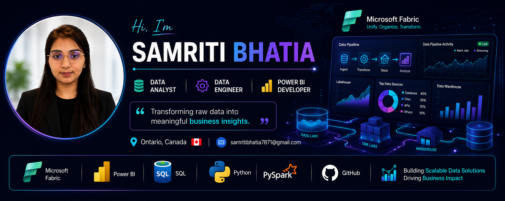
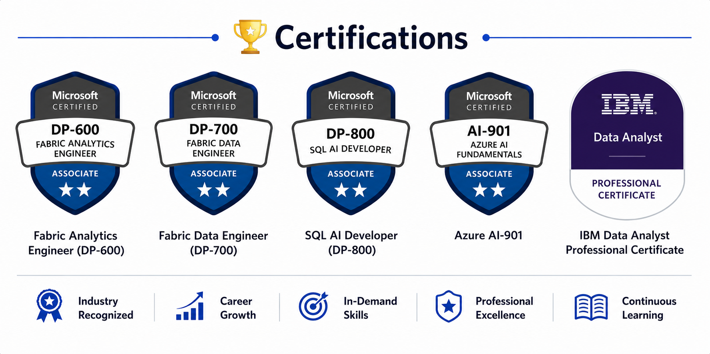

  

<h4 align="center">🤝 Connect with Me</h4>

  &nbsp;
  &nbsp;
  

---

## 👩‍💻 About Me

<table width="60%">
  <tr>
    <td width="55%" valign="top">
      Data professional with <strong>4+ years of experience</strong> in data analytics, reporting, and data engineering.
      I build end-to-end analytics solutions using <strong>Microsoft Fabric, Power BI, SQL, Python, PySpark, and Azure</strong>.
      I enjoy transforming complex data into actionable insights that support informed decision-making, operational efficiency, and business growth.
    </td>
    <td width="30%" valign="top">
      🎯 4+ Years of Experience 
      📊 Power BI Dashboard Development 
      ⚡ ETL/ELT Pipeline Development 
      🚀 Process Automation and Optimization 
      🕒 Real-Time Monitoring Solutions 
      🌱 Continuous Learner
    </td>
  </tr>
</table>

---

## 🚀 Core Competencies

  &nbsp;
  &nbsp;
  &nbsp;
  &nbsp;
  &nbsp;
  &nbsp;
  &nbsp;
  &nbsp;
  

---

## 🛠️ Technical Skills

### 💻 Languages

  &nbsp;
  &nbsp;
  &nbsp;
  &nbsp;
  

### 📊 Data Analytics and Business Intelligence

  &nbsp;
  &nbsp;
  &nbsp;
  &nbsp;
  &nbsp;
  &nbsp;
  

### ☁️ Cloud and Data Integration

  &nbsp;
  &nbsp;
  &nbsp;
  

### 🗄️ Databases

  &nbsp;
  

### ⚙️ Automation and Development Tools

  &nbsp;
  &nbsp;
  &nbsp;
  &nbsp;
  

### 📈 Methodologies

  &nbsp;
  &nbsp;
  &nbsp;
  &nbsp;
  &nbsp;
  &nbsp;
  

---

## 📁 Featured Projects

<table width="70%">
<tr>
<td width="33%" valign="top">
<h4>🏥 Clinical Data Analytics</h4>
<small>
Built Fabric-based Medallion pipelines and Power BI dashboards for clinical reporting and data quality.
</small>
  

</td>

<td width="33%" valign="top">
<h4>⚡ Real-Time IoT Analytics</h4>
<small>
Developed near real-time sensor monitoring, dashboards, and automated operational alerts.
</small>
  

</td>

<td width="33%" valign="top">
<h4>🍜 Restaurant Sales Analytics</h4>
<small>
Created dashboards for sales, product performance, inventory, and customer insights.
</small>
  

</td>

</tr>
</table>

---

## 🏆 Certifications

  

